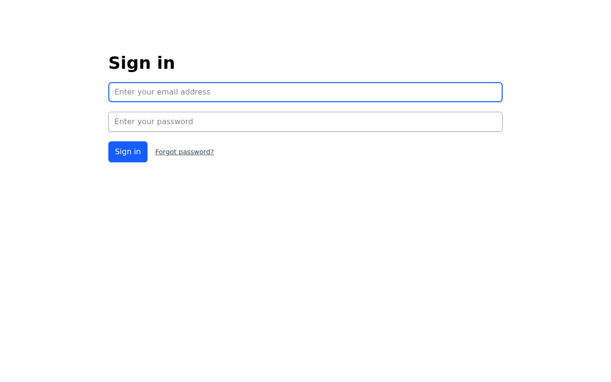
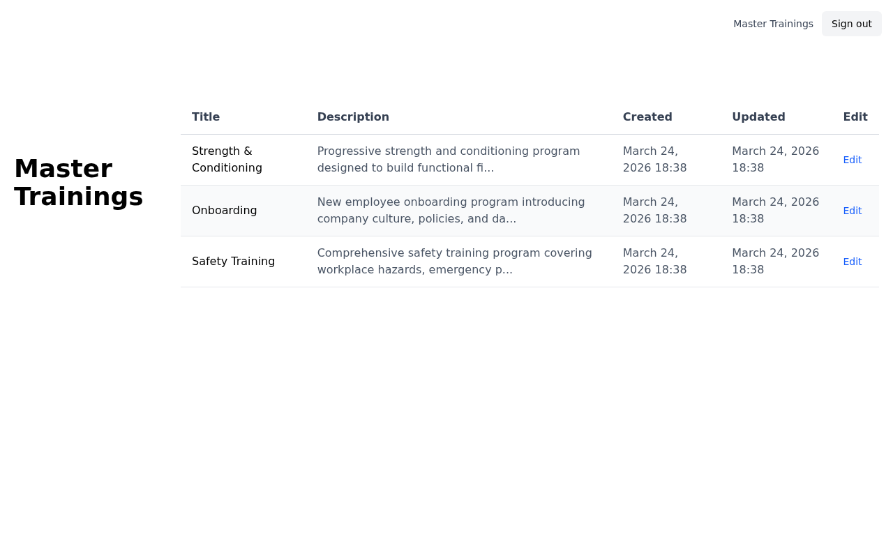
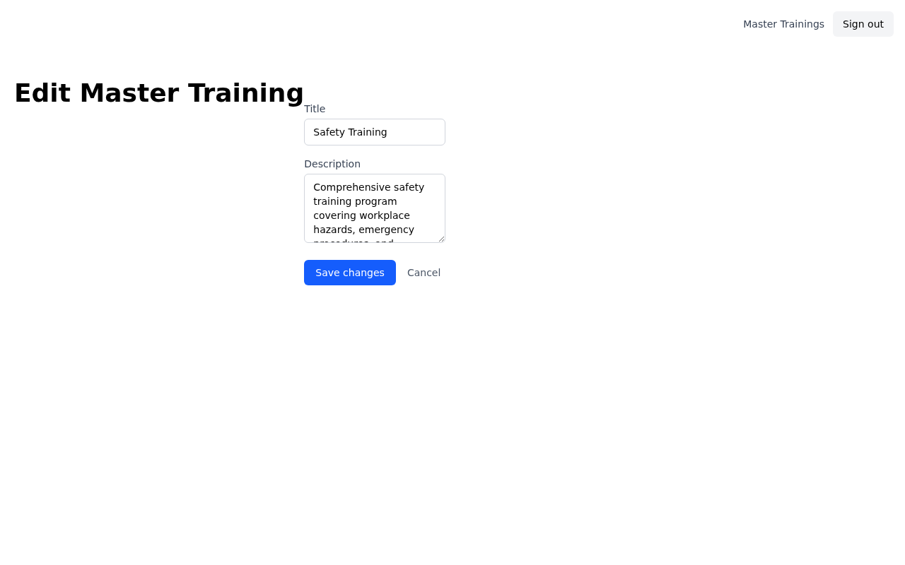
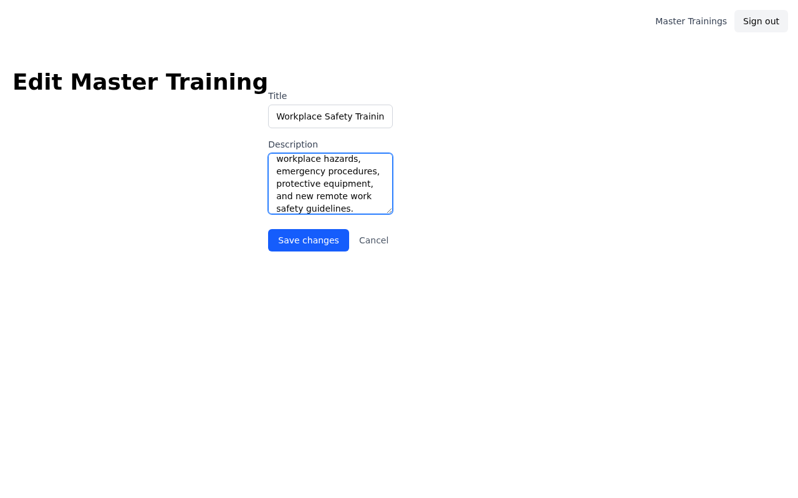
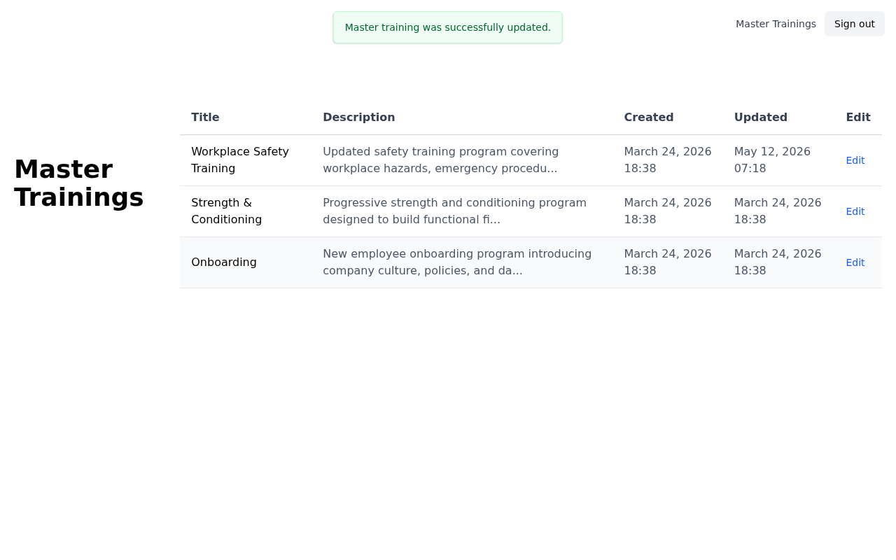
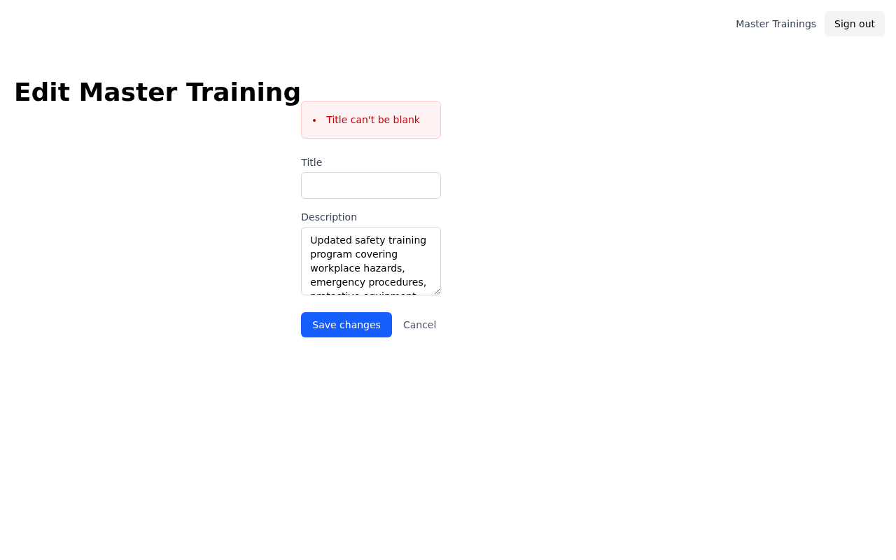

# Issue #116 — Edit Master Training

Trainers can now edit the title and description of their master trainings directly from the dashboard.

---

## Scene 1 — Sign in

A trainer navigates to the app and signs in with their credentials. Only users with the trainer role can access master trainings.

---

## Scene 2 — Master Trainings index

After signing in, the trainer lands on the Master Trainings dashboard. The table lists all trainings for their account — title, description, created/updated timestamps — and a new **Edit** link on each row.

---

## Scene 3 — Edit form (pre-populated)

Clicking **Edit** opens the edit page. The form pre-fills both the **Title** and **Description** fields with the current values so the trainer can make targeted changes without retyping everything.

---

## Scene 4 — Edit form (updated values)

The trainer updates the title and description. A **Cancel** link is available to return to the index without saving.

---

## Scene 5 — Success confirmation

Submitting the form redirects back to the index. A flash notice confirms the update, and the table immediately reflects the new title and an updated **Updated** timestamp.

---

## Scene 6 — Validation error

If the title is cleared and the form is submitted, the page re-renders with an inline error message. The trainer stays on the edit page so they can correct the mistake without losing context.

---

## Video walkthrough

[walkthrough.webm](walkthrough.webm)
