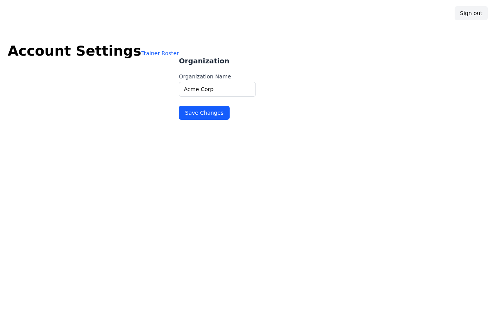
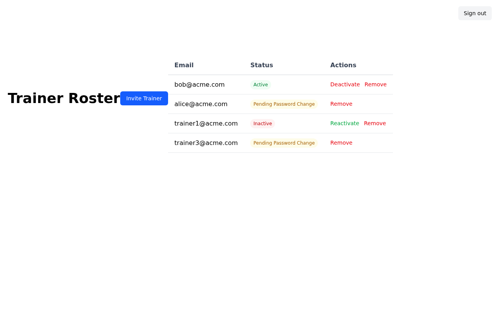
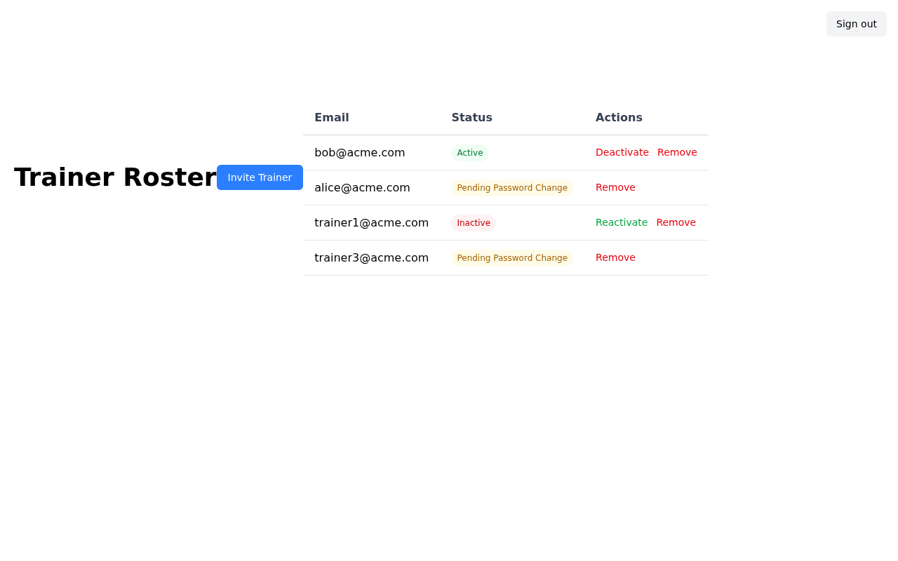
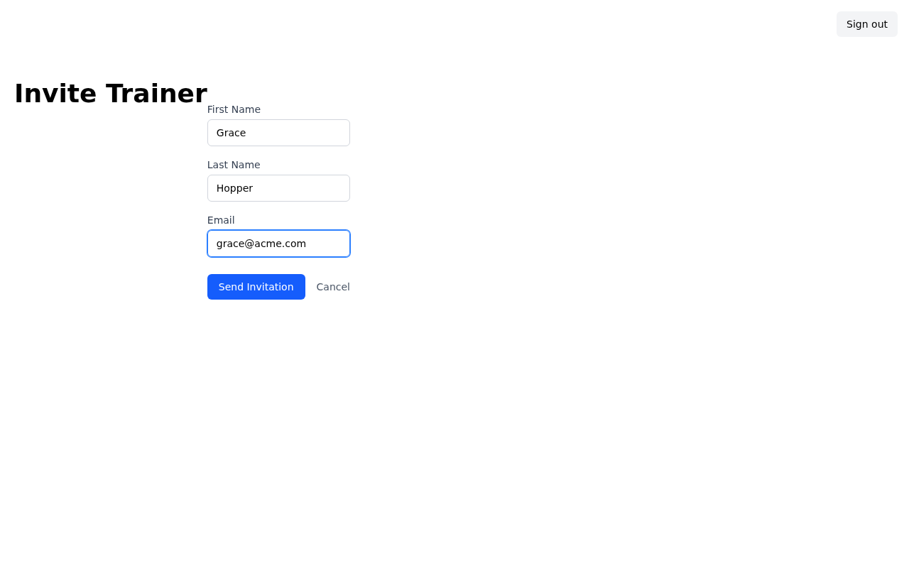
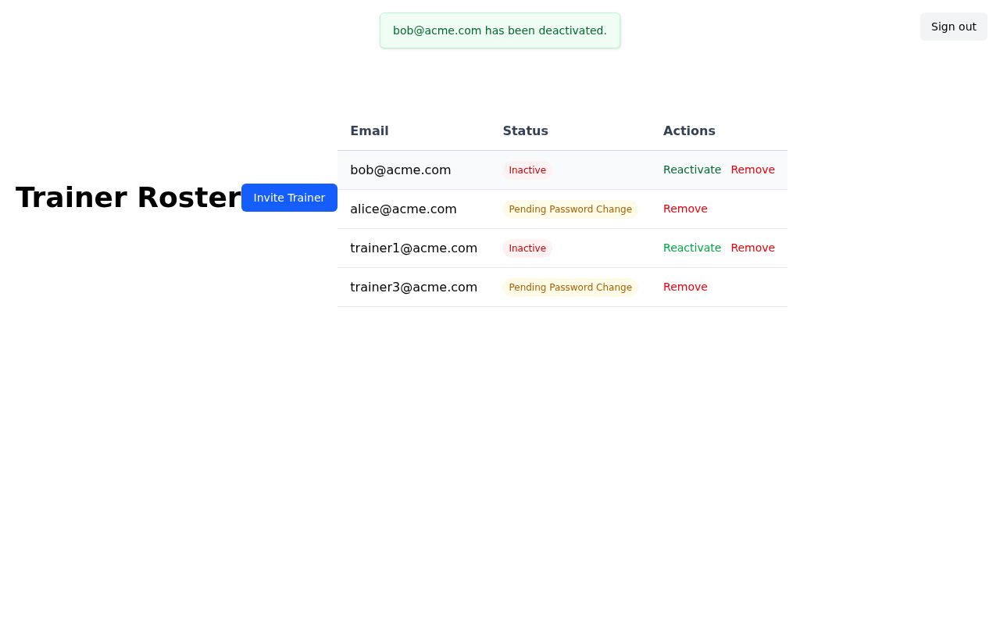
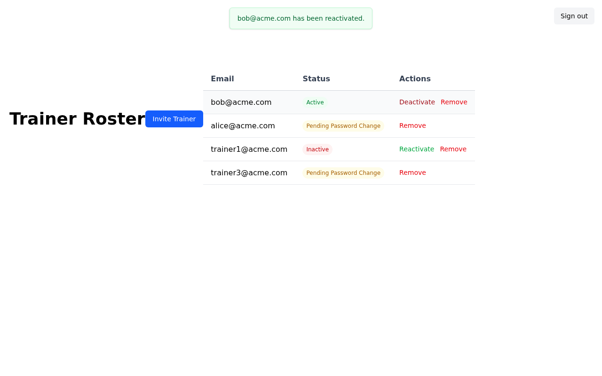
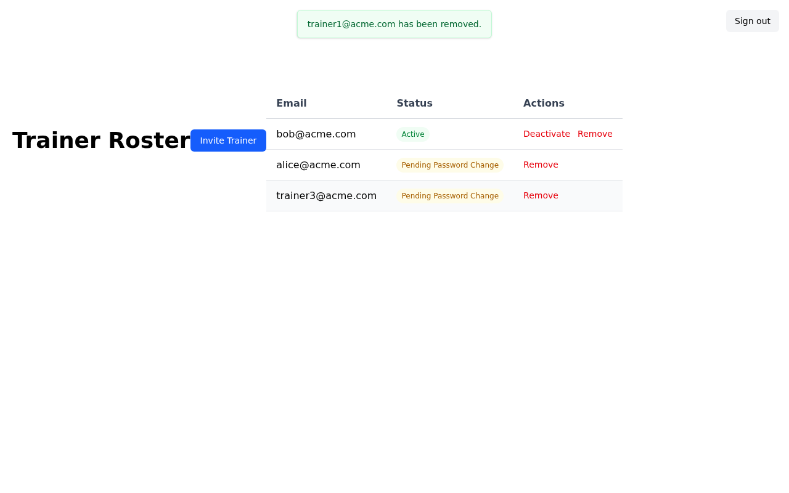

# Trainer Roster Management — Feature Walkthrough

This storyboard demonstrates the trainer roster management feature for account admins, including viewing trainer statuses, deactivating/reactivating trainers, inviting new trainers, and permanently removing trainers from the roster.

---

## Step 1 — Sign In

The account admin navigates to the sign-in page and enters their credentials.

---

## Step 2 — Account Settings

After signing in, the admin lands on the Account Settings page. The **Trainer Roster** link is accessible from here.

---

## Step 3 — Trainer Roster

Clicking **Trainer Roster** shows the full list of trainers for this account. Each trainer displays their email address, a color-coded status badge, and available actions:

- **Active** trainers (green badge) show **Deactivate** and **Remove** actions
- **Inactive** trainers (red badge) show **Reactivate** and **Remove** actions
- **Pending Password Change** trainers (yellow badge) show only **Remove** (cannot be deactivated until they set their password)

---

## Step 4 — Invite a Trainer

Clicking **Invite Trainer** opens the invitation form. The admin fills in the new trainer's first name, last name, and email address. Submitting the form sends them an invitation email with a link to set their password.

---

## Step 5 — Deactivate a Trainer

The admin clicks **Deactivate** on an active trainer. A confirmation dialog asks them to confirm the action (noting the trainer will be logged out immediately). After confirming, the trainer's status changes to **Inactive** and a success notice is shown.

---

## Step 6 — Reactivate a Trainer

The admin clicks **Reactivate** on an inactive trainer. After confirming the dialog, the trainer's status is restored to **Active** and a success notice is shown.

---

## Step 7 — Remove a Trainer

The admin clicks **Remove** on a trainer. A confirmation dialog warns that this action is permanent and cannot be undone. After confirming, the trainer is permanently deleted from the roster and a success notice confirms the removal.

---

## Video Walkthrough

A full video of the feature walkthrough is available at [`walkthrough.webm`](walkthrough.webm).
