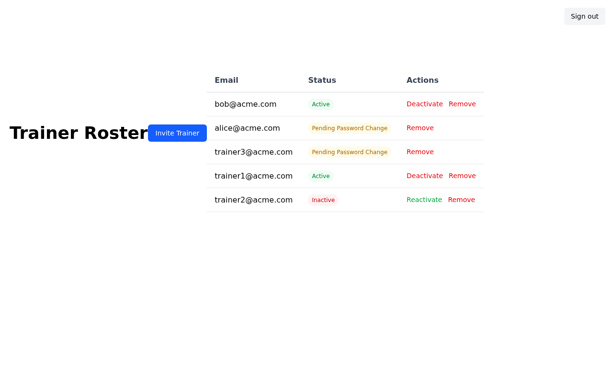
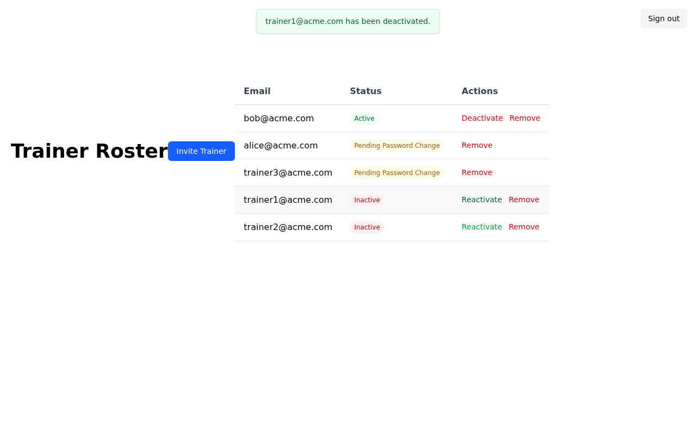
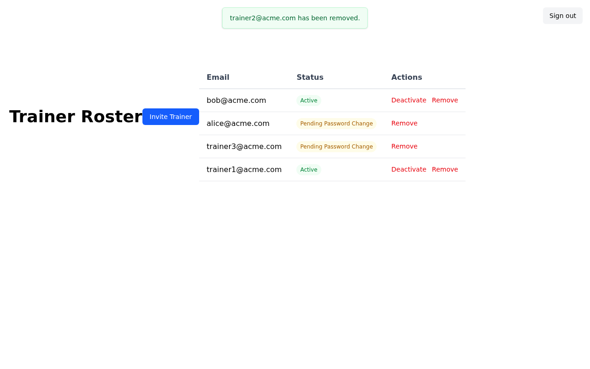
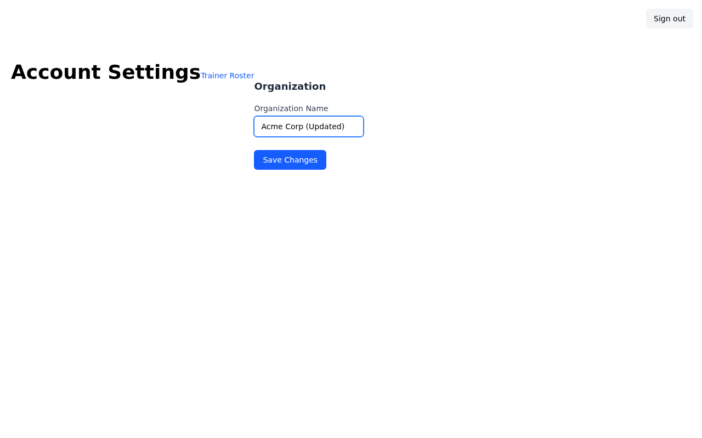
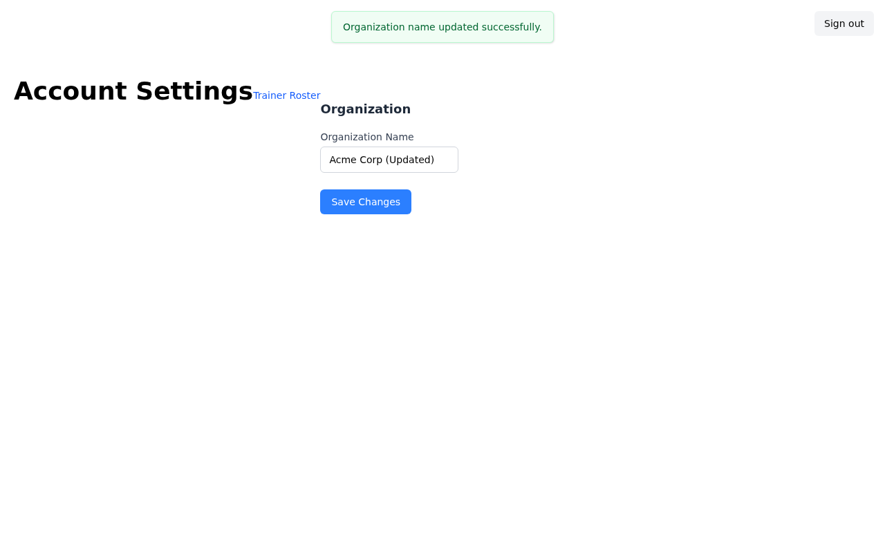

# Issue #61 — Cross-Tenant Data Isolation

This walkthrough demonstrates that account admins can only see and modify data belonging to their own tenant. Attempting to access another tenant's trainers or settings returns **404 Not Found**.

**Video:** [walkthrough.webm](walkthrough.webm)

---

## 1. Sign In as Account Admin


The Acme Corp account admin (`admin@acme.com`) signs in. Each client account has its own isolated data space — admins can only see and manage their own tenant.

---

## 2. Account Settings — Tenant-Scoped View


After signing in, the admin lands on the Account Settings page. The organization name shown is **Acme Corp** only. No data from Beta Inc or Gamma Ltd appears anywhere on this page.

The controller resolves the current tenant from `Current.user.client`, so every database query is automatically scoped:

```ruby
# account/settings_controller.rb
def edit
  @client = current_client   # always Current.user.client
end
```

---

## 3. Trainer Roster — Cross-Tenant Isolation


Navigating to **Trainer Roster** shows only trainers belonging to Acme Corp:

| Email | Status |
|---|---|
| trainer1@acme.com (Alice Smith) | Active |
| trainer2@acme.com (Bob Jones) | Inactive |
| trainer3@acme.com (Carol White) | Pending Password Change |

`trainer1@beta.com` (Frank Green, Beta Inc) is completely absent. The query used is:

```ruby
# account/trainers_controller.rb
def index
  @trainers = current_client.users.trainers
end
```

Any attempt to PATCH or DELETE a trainer ID belonging to a different client silently returns **404** because the `find` is scoped through `current_client.users.trainers`.

---

## 4. Deactivate a Trainer



Alice Smith is currently **Active** (green badge). Clicking **Deactivate** raises a browser confirmation dialog to prevent accidental changes.



After confirming, Alice's status badge changes to **Inactive** (red) and a flash message confirms the action. The Reactivate button replaces Deactivate.

---

## 5. Reactivate a Trainer


Clicking **Reactivate** (with confirmation) restores Alice to **Active** status. Deactivate/Reactivate are non-destructive toggle operations — they change the trainer's `status` column without removing the record.

---

## 6. Remove a Trainer


Bob Jones (Inactive) can be permanently removed from the roster.



After confirming the removal, Bob no longer appears in the table. This action is irreversible.

**Cross-tenant isolation applies here too:** a DELETE request to `/account/trainers/:id` where `:id` belongs to a different client returns `404 Not Found`. The record is never found because the destroy action looks up the trainer through the tenant scope:

```ruby
def set_trainer
  @trainer = current_client.users.trainers.find(params[:id])
  # raises ActiveRecord::RecordNotFound → renders 404
end
```

---

## 7. Update Organization Name



The admin can update Acme Corp's organization name. Only `current_client` is updated — other tenants' records are untouched.



A success flash message confirms the save. Other tenants (Beta Inc, Gamma Ltd) are unaffected.

---

## 8. Sign Out


Signing out terminates the session. Each user session is tied to a single tenant — there is no mechanism to switch tenants or escalate access.

---

## Summary of Isolation Boundaries

| Action | Scoped by | Cross-tenant attempt result |
|---|---|---|
| View trainer roster | `current_client.users.trainers` | Other trainers simply don't appear |
| Deactivate / Reactivate trainer | `current_client.users.trainers.find(id)` | 404 Not Found |
| Remove trainer | `current_client.users.trainers.find(id)` | 404 Not Found |
| View account settings | `current_client` | Other tenants' names not visible |
| Update account settings | `current_client` | Only own tenant record updated |
