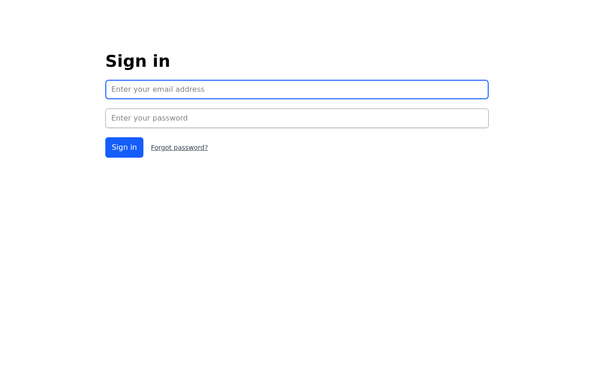
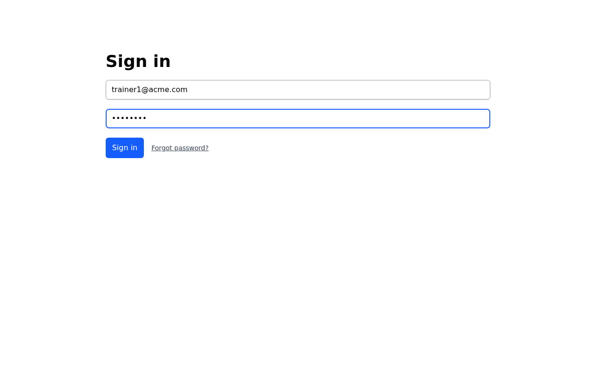
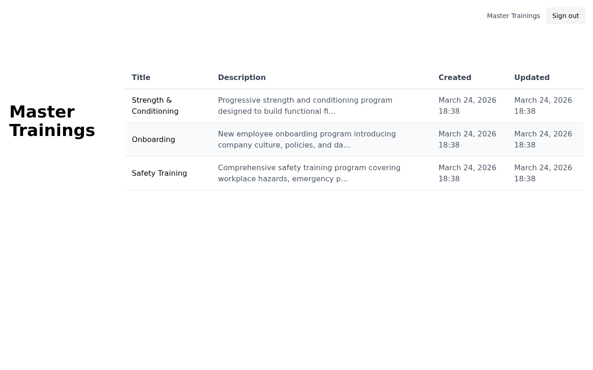
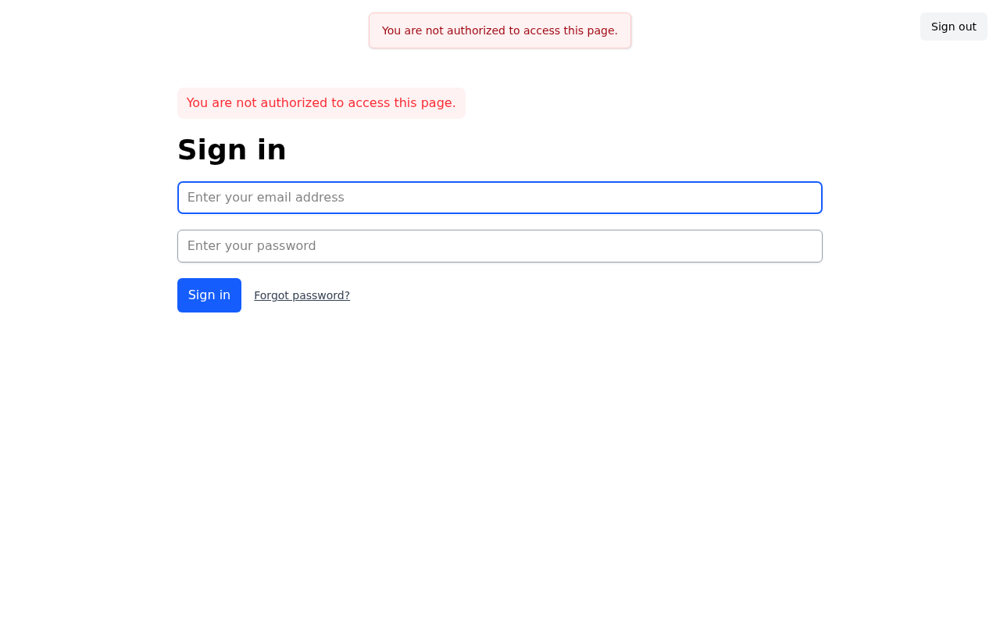

# Master Trainings Dashboard — Feature Walkthrough

This storyboard demonstrates the Master Trainings dashboard introduced in issue #62. Trainers are automatically redirected to this dashboard upon sign-in and can view all master trainings belonging to their account. Access is restricted to trainers only — admins are redirected away with an authorization error.

---

## Step 1 — Sign In

The trainer navigates to the sign-in page and enters their credentials.

---

## Step 2 — Automatic Redirect to Master Trainings Dashboard

After signing in, trainers are automatically redirected to `/master_trainings` — their primary landing page. The dashboard displays all master trainings for the account in a table ordered by most recently updated, with columns for:

- **Title** — the name of the training program
- **Description** — a truncated preview (up to 80 characters)
- **Created** — when the training was created
- **Updated** — when the training was last modified

---

## Step 3 — Admin Landing Page (Account Settings)

When a client admin signs in, they land on the **Account Settings** page instead of the Master Trainings dashboard. Admins have a different role and a different default destination.

---

## Step 4 — Access Control: Admin Blocked from Dashboard

If an admin attempts to navigate directly to `/master_trainings`, they are immediately redirected away with the message:

> "You are not authorized to access this page."

Only users with the **trainer** role can access the Master Trainings dashboard.

---

## Video Walkthrough

A full video recording of the above steps is available at [walkthrough.webm](walkthrough.webm).
