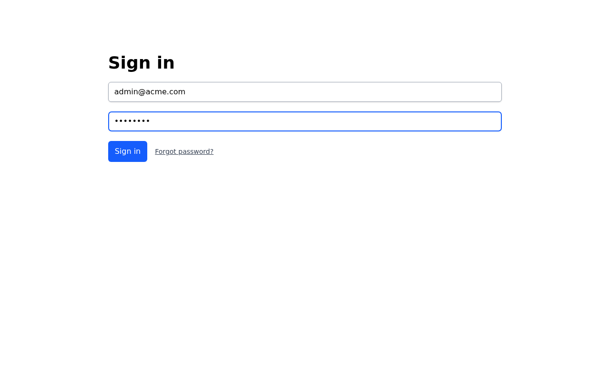
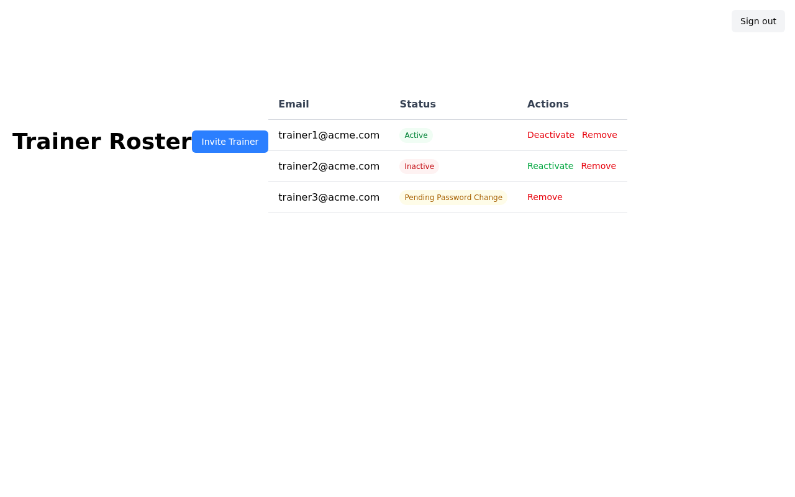
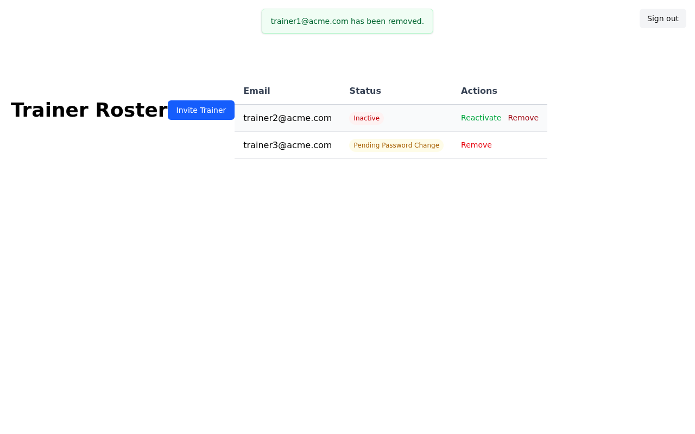

# Trainer Removal — Feature Walkthrough

This storyboard demonstrates an account admin permanently removing a trainer from the roster. The feature includes a browser-native confirmation dialog before the deletion proceeds, ensuring the admin does not accidentally delete a trainer.

---

## Step 1 — Sign In

The account admin navigates to the sign-in page and enters their credentials.

---

## Step 2 — Account Settings

After signing in, the admin lands on the Account Settings page. The **Trainer Roster** link is available in the navigation.

---

## Step 3 — Trainer Roster

Clicking **Trainer Roster** displays all trainers for this account. Each row shows the trainer's email address, a color-coded status badge, and action buttons:

- **Active** trainers (green badge) show **Deactivate** and **Remove** actions
- **Inactive** trainers (red badge) show **Reactivate** and **Remove** actions
- **Pending Password Change** trainers (yellow badge) show only the **Remove** action

---

## Step 4 — Confirm Removal

When the admin clicks **Remove** on a trainer, the browser displays a native confirmation dialog:

> "Permanently remove trainer1@acme.com? This action cannot be undone."

The admin must explicitly confirm before the deletion proceeds. This prevents accidental removals.

---

## Step 5 — Trainer Removed

After confirming, the trainer's user record is permanently deleted from the database. A success flash message confirms the action and the trainer no longer appears in the roster table.

---

## Video Walkthrough

A full video recording of the above steps is available at [walkthrough.webm](walkthrough.webm).
