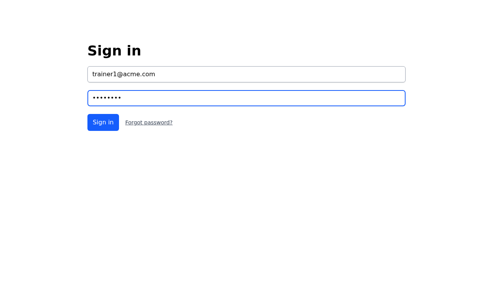
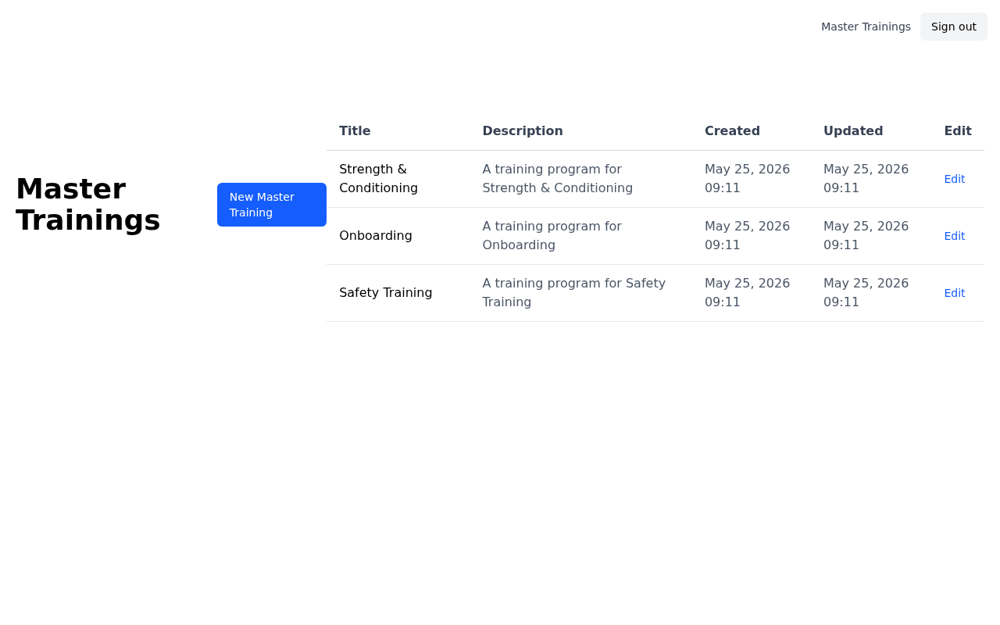
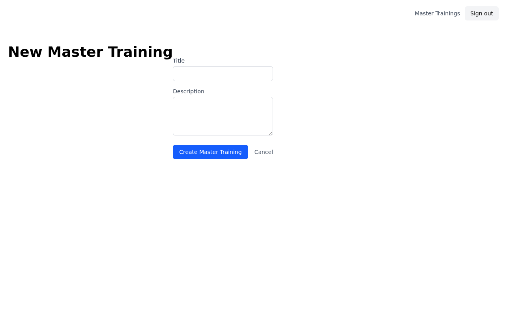
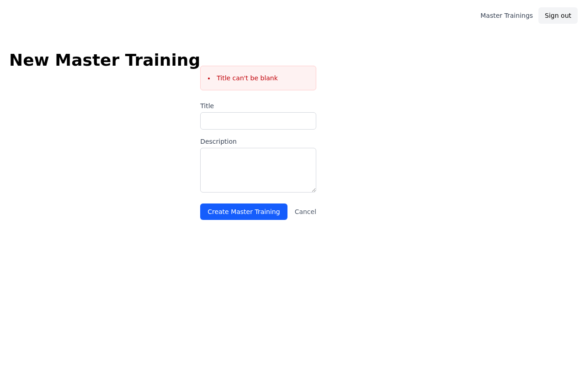
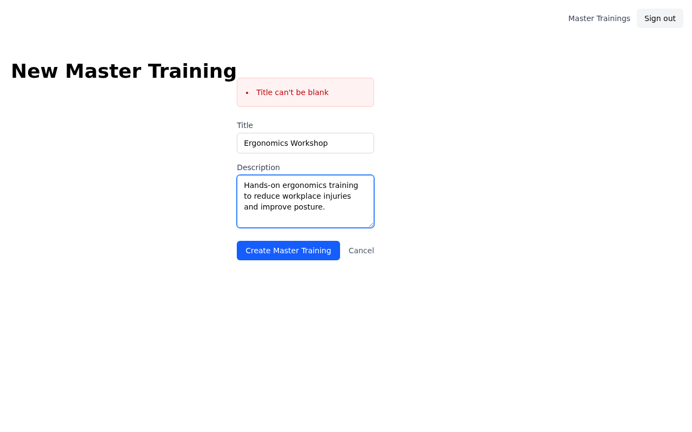
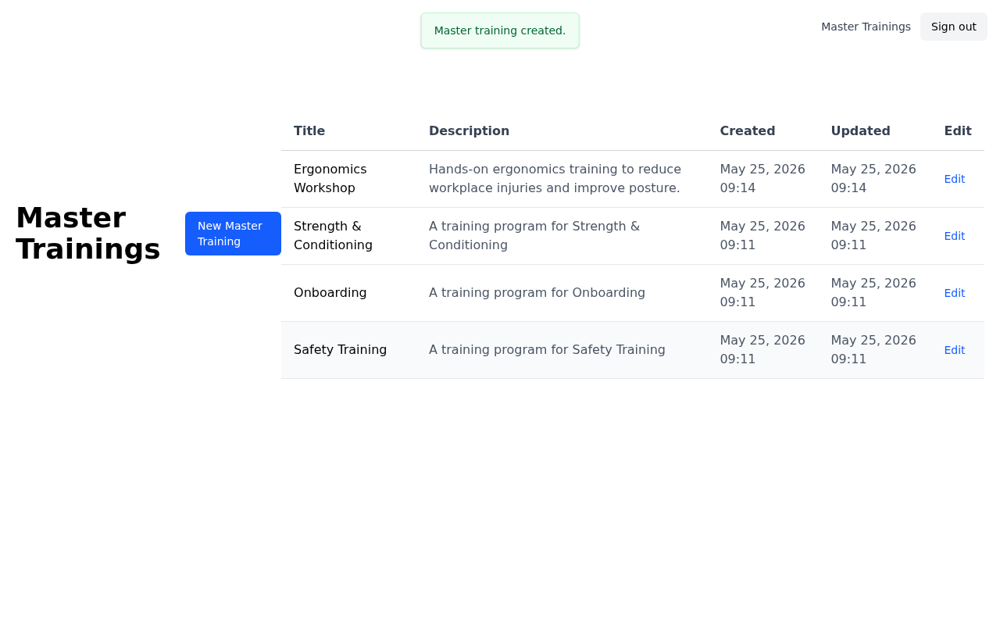
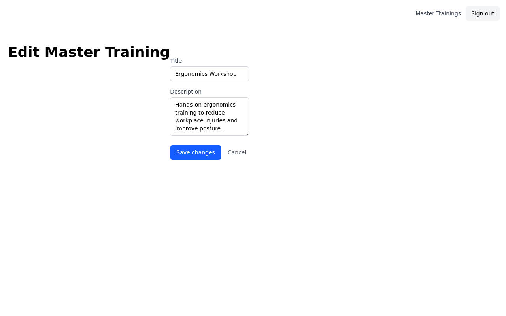
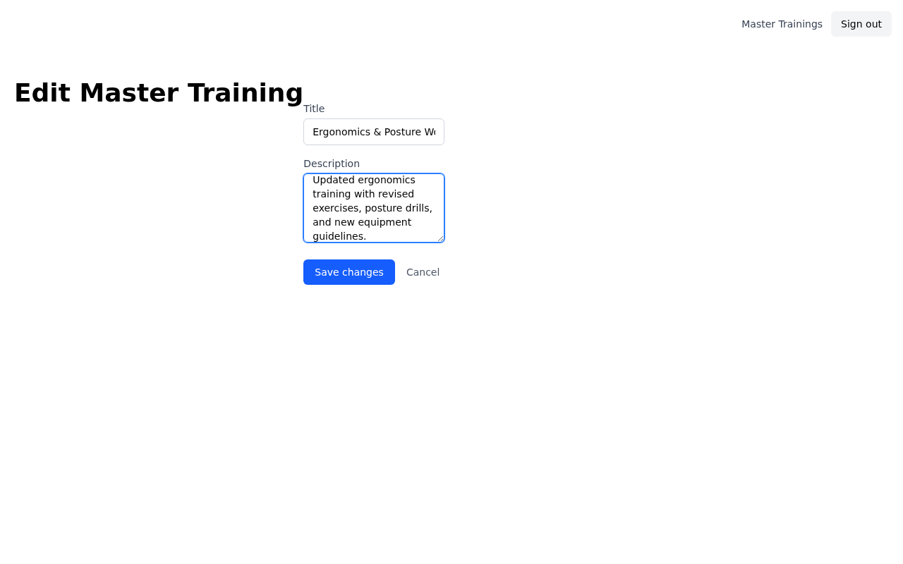
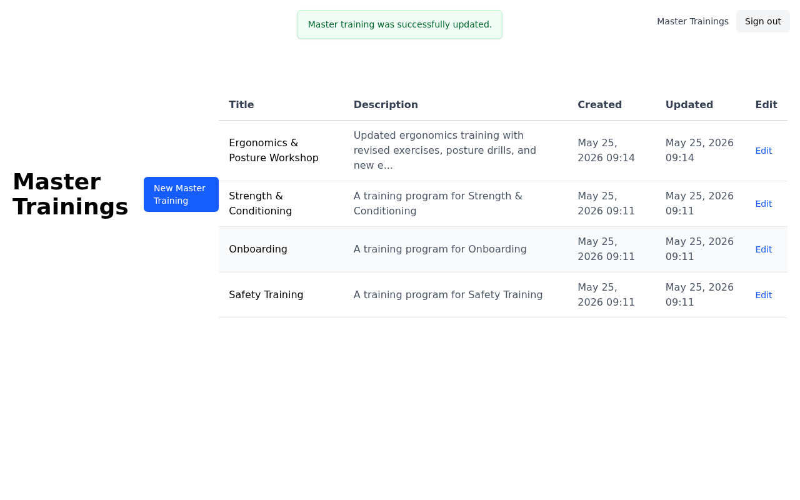

# Issue #70 — Create Master Training: Feature Walkthrough

> **Video:** [walkthrough.webm](walkthrough.webm)

Master trainings are reusable training templates that a trainer creates once and can reference across multiple sessions. This walkthrough covers the full lifecycle: creating a new training, hitting a validation error, saving successfully, and editing the training afterward.

---

## Scene 1 — Sign in as a trainer

The feature is scoped to trainers. Alice Smith (`trainer1@acme.com`) signs in with her password. Non-trainers (client admins, super admins) are blocked from accessing master trainings entirely.

---

## Scene 2 — Master Trainings index

After signing in, trainers land directly on the Master Trainings index at `/master_trainings`. The table shows all trainings belonging to their client, sorted by most-recently updated. Three existing trainings are visible: "Strength & Conditioning", "Onboarding", and "Safety Training". The **New Master Training** button in the top-left launches the creation flow.

---

## Scene 3 — New training form (empty)

The form at `/master_trainings/new` has two fields:

- **Title** (required) — the name of the training
- **Description** (optional) — a free-text description

A **Create Master Training** button submits the form; a **Cancel** link returns to the index without saving.

---

## Scene 4 — Validation: blank title

Submitting with an empty Title field returns a 422 and re-renders the form in place. A red error box at the top of the form lists every validation message — here, "Title can't be blank". The form fields retain their previous values so the trainer doesn't lose their work.

---

## Scene 5 — Filling in the form

The trainer fills in a title ("Ergonomics Workshop") and a description before submitting. Description is optional and has no character limit shown in the UI.

---

## Scene 6 — Training created successfully

On a valid submission, the trainer is redirected to the index and a green toast notification confirms "Master training created." The new "Ergonomics Workshop" appears at the top of the table (sorted by `updated_at` descending), with its description truncated to 80 characters.

---

## Scene 7 — Edit form (pre-filled)

Clicking **Edit** on any row opens the edit form at `/master_trainings/:id/edit`. Both fields are pre-filled with the current values. The button label changes to **Save changes** to distinguish it from the create form.

---

## Scene 8 — Editing title and description

The trainer updates the title to "Ergonomics & Posture Workshop" and revises the description with more detail. Submitting sends a `PATCH` request to `/master_trainings/:id`.

---

## Scene 9 — Training updated successfully

A green toast confirms "Master training was successfully updated." The row in the table reflects the new title and truncated description immediately. The `updated_at` timestamp advances while `created_at` stays the same.

---

## Scene 10 — Final state

The index now shows four trainings. "Ergonomics & Posture Workshop" sits at the top because it was most recently updated. The three original trainings remain unchanged below it.

---

## Key behaviours

| Behaviour | Detail |
|---|---|
| Authorization | Only `trainer?` users can access any master training route; others get a root redirect with an alert |
| Client isolation | Trainers see only their own client's trainings; cross-client access returns 404 |
| Validation | Title presence is enforced server-side; errors render inline above the form fields |
| Sort order | Index is sorted by `updated_at DESC` — edits float a training to the top |
| Description truncation | Index truncates descriptions to 80 characters with `…` |
